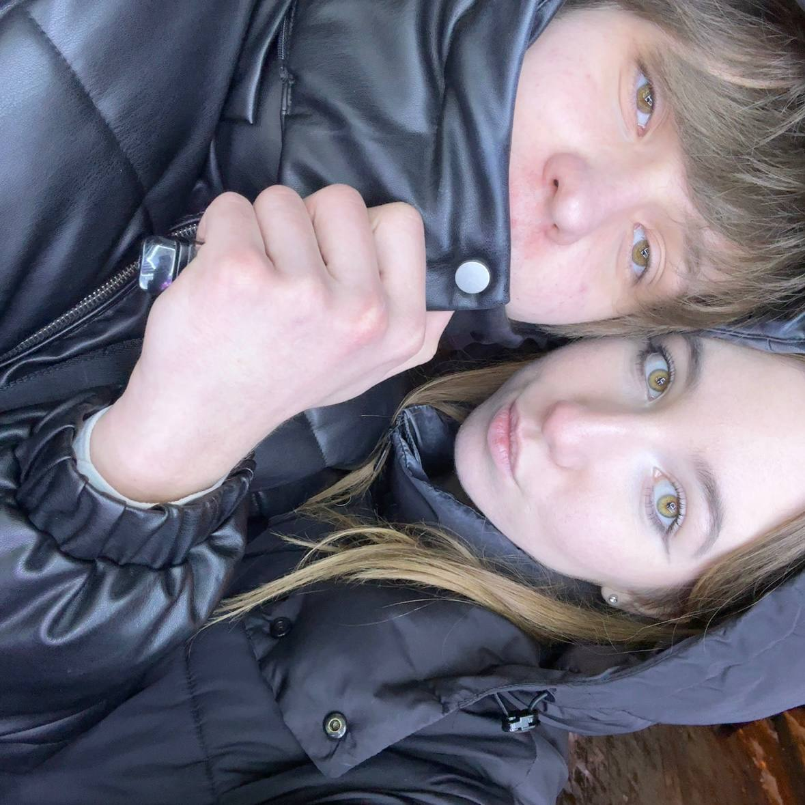
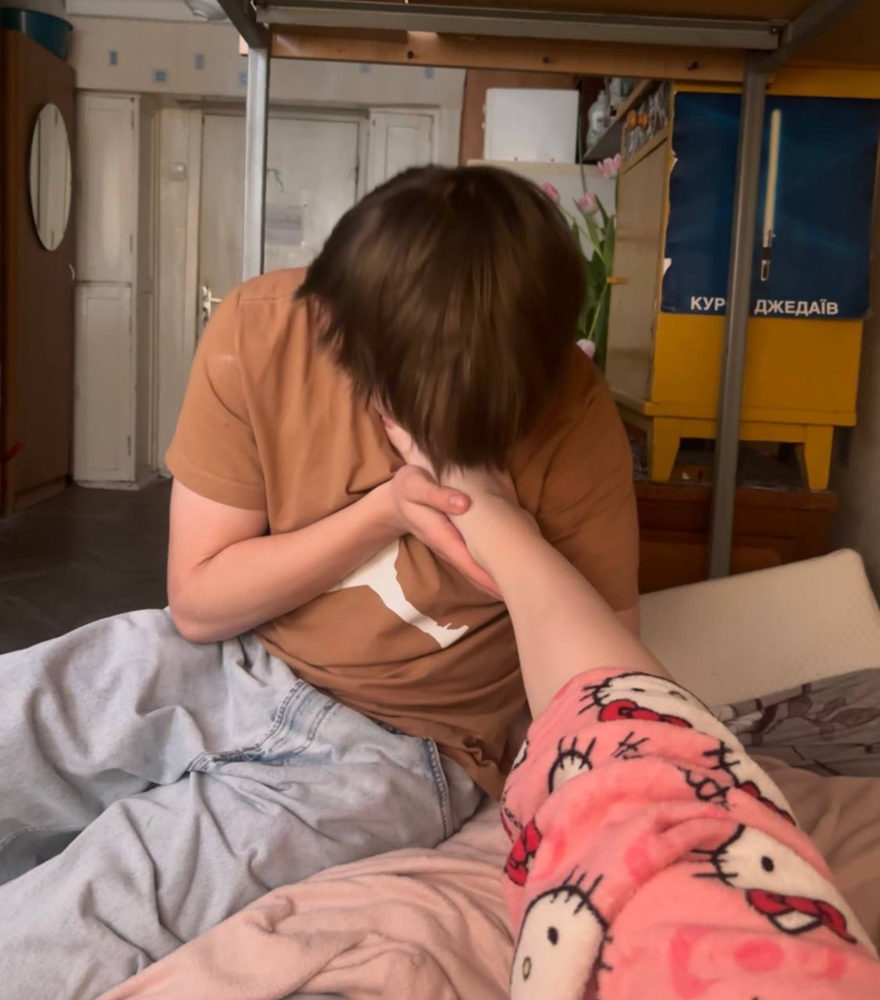
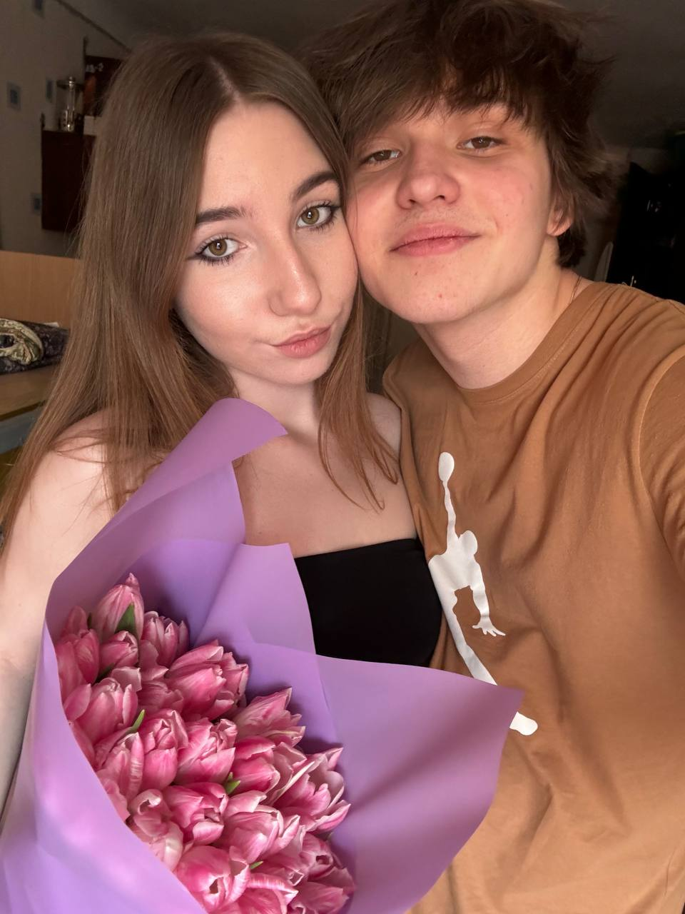
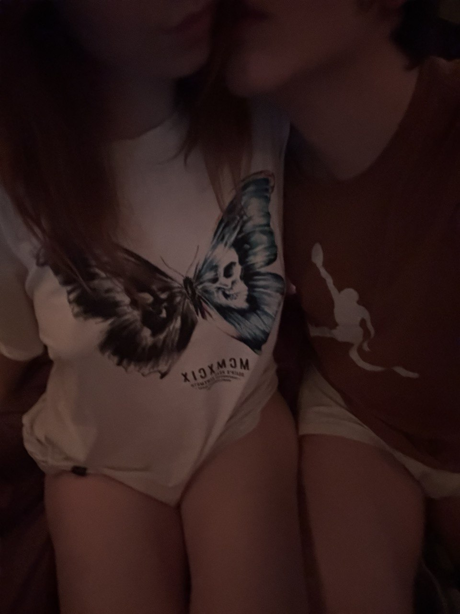
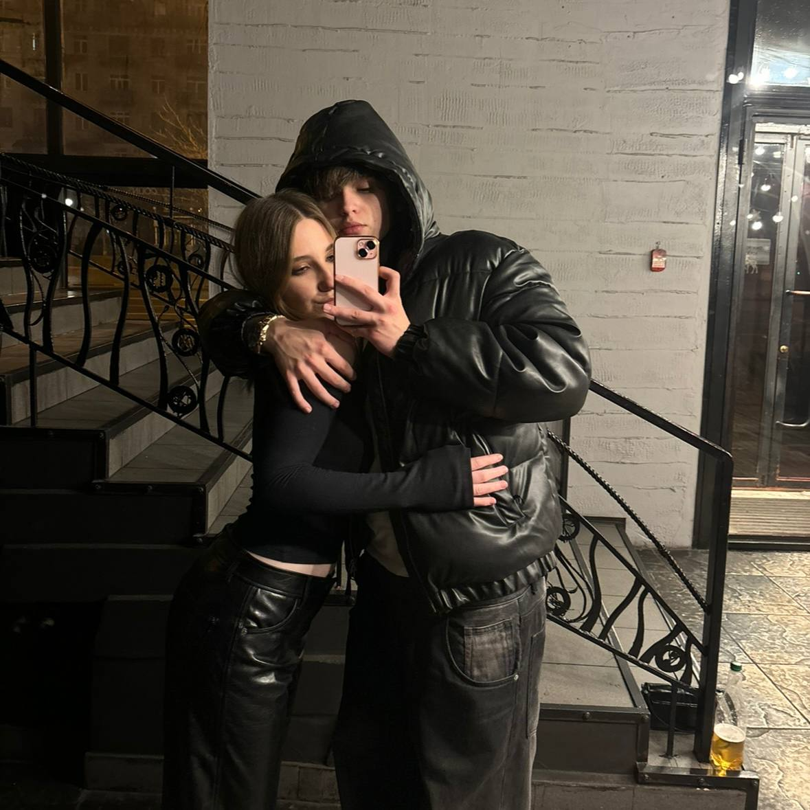

<!DOCTYPE html>
<html lang="ru">
<head>
    <meta charset="UTF-8">
    <meta name="viewport" content="width=device-width, initial-scale=1.0">
    <title>Поздравление с пол года</title>
    
</head>
<body>

<!-- Главная страница -->

    <h1>Поздравляю с пол года, любимый</h1>
    
     
    <button class="btn" onclick="showButtons()">Нажми</button>

<!-- Страница с кнопками-прямоугольниками -->

    <h1>Выберите раздел</h1>
    

        <button class="large-btn" onclick="showLovePage()">Почему я тебя люблю</button>
        <button class="large-btn" onclick="showGalleryPage()">Наши фоточки</button>
        <button class="large-btn" onclick="showCongratsPage()">Поздравляю!!</button>
    

    <button class="back-btn" onclick="goBack('home-page')">Назад</button>

<!-- Страница "Почему я тебя люблю" -->

    <h1>Почему я тебя люблю</h1>
    

        <button class="large-btn" onclick="showText(1)">Нажми</button>
        <button class="large-btn" onclick="showText(2)">Нажми</button>
        <button class="large-btn" onclick="showText(3)">Нажми</button>
        <button class="large-btn" onclick="showText(4)">Нажми</button>
        <button class="large-btn" onclick="showText(5)">Нажми</button>
    

    

    

 <!-- Место для изображения -->
    <button class="back-btn" onclick="goBack('button-page')">Назад</button>

<!-- Страница "Наши фоточки" -->

    <h1>Наши фоточки</h1>
    

        <button class="arrow left" onclick="prevImage()">&#10094;</button>
        
        <button class="arrow right" onclick="nextImage()">&#10095;</button>
    

    <button class="back-btn" onclick="goBack('button-page')">Назад</button>

<!-- Страница "Поздравляю!!" -->

    <h1>Поздравляю нас с пол года!</h1>
    

        <button class="btn" onclick="openEnvelope()">Открыть письмо</button>
    

    

        
Любимый Бодечка, поздравляю нас с пол года наших отношений. Я очень рада, что мы с тобой познакомились, встретились, и рада, что встретились именно так. Я безумно дорожу нашими отношениями и хочу чтоб мы были вместе всегда. Спасибо тебе за все моменты, за все подарки, за все твое внимание и старания и прости, если я что-то делаю не так, но я очень стараюсь для нас. Просто знай, что я очень тебя люблю и ценю. Eres mio💋

    

    <button class="back-btn" onclick="goBack('button-page')">Назад</button>

</body>
</html>
